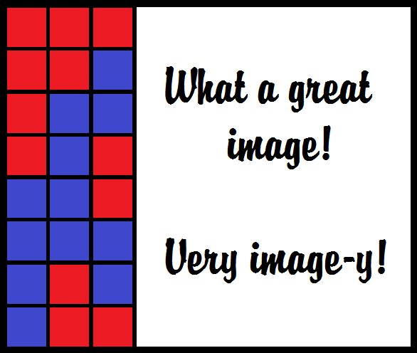

## Title
[previous tutorial ->  ]()

**Objectives** :

**Task** : 

**Starting Point** - Your code from last time.

**Process** - 

1. 

2.

3.

[next tutorial -> currently under construction, woops...](../README.md)

[Back to Main](../README.md)
