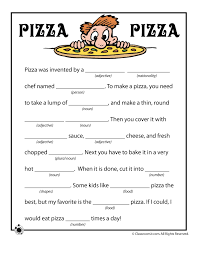

## Let's Learn More Variables!

[<- Previously: Let's Learn Variables!](Math.md)

**Objectives**: Expand on our variable knowledge

**Starting Point**: [This Code](https://ideone.com/mgLXmw)

**Process**: 

1. In the previous lesson we learned about variables called integers ```int``` and doubles ```double```. We mostly focused on integers, and learned about integer division and how to store numbers in variables. We're going to expand a little more on variables in this lesson.

Open the starter code, it's pretty short and I bet you know roughly was it does, but I want to clarify the line with ```printf```. 

```cpp
printf("Our team number is %d", team_number);
```

So to start, ```printf`` is a *function* that we use to tell the computer we want to print something to the screen. We can tell its a function because its followed by parenthesis with some stuff inside of them. The stuff inside of the parenthesis are called *arguements*.

The arguement for our ```printf``` function is 

```"Our team number is %d", team_number```

For the most part, we're saying "hey computer, print these characters exactly," but it doesn't print the ```%d``` literally. Instead it prints the value of ```team_number```, why is that?
```%d``` is what called a *format specifiier*. *Format specifiier* is a fancy way of saying "a blank spot that we tell the computer to fill in." Its a very similar concept to madlibs. We use these when we want to print the value of a variable. **Change the value of** ```team_number``` **and run the code.**



The output of the code should have changed to print that our team number is the new value you set ```team_number``` to. If you haven't, change the number to a negative number... do you think it will print the negative sign?

What if we wanted to print multiple variables in one line? We would add more format specifiers!

Lets modify our code so it prints "Our team number is %d and we have %d students". Lets also add a variable that will hold the number of students, I'll call mine ```num_kids``` but you can call yours whatever you'd like. Lastly, lets tell the computer that the second format specifier should print the value of ```num_kids```.
Our main body should look like this:

```cpp
	int team_number = 1296;
	int num_kids = 24; 
 
	printf("Our team number is %d and we have %d students", team_number, num_kids);
```

Click run to test your code. Did it work?

Change your printf arguement so that ```num_kids``` is before ```team_number``` (don't forget the comma!) and click run. What changed? How does the computer pick which variable to put in which spot?

2.  Now lets try printing a _double_. After we print out our team number, lets make a double. I'm going to call mine pie and pick a value to assign to it. You can pick whatever name and value you want, just make sure its a decimal:

```cpp
	double pie = 3.1415;
```
Using ```printf()```, lets print out our _double_:

```cpp
	printf("The value of pie is %d",pie);
```
Compile and run your code - did it behave how you expected? 

When we use the format specifier ```%d``` we are telling the computer we are going to print a integer. I like to think of it as a similar idea to in madlibs when the blanks have the type of word under them (adjective, verb, noun, etc). Sometimes madlibs is more fun when you ignore the type of word, but more often it just doesn't make any sense - its the same with format specifiers.

The format specifier for doubles is ```%lf```. Lets change fix our code so when we print the value of our double, we're using ```%lf``` instead of ```%d```. Compile and run. Does it look better?

3. So, now that we're feeling good - lets open [this code](https://ideone.com/qdeNlR). Look at the format specifiers and fix the code so that it prints out the values of ingredient_1 and ingredient_2 in the right order. 

4. And beyond...

There are more variable types than %d and %lf, and we'll be printing them later. For now, here is a table for format specifiers:

| Type   | Declaration         | Specifier | Printed  |
|--------|---------------------|-----------|----------|
| int    | int i = 5;          | %d        | 5        |
| double | double i = 5.555;   | %lf       | 5.555    |
| char   | char i = 'z';       | %c        | z        |
| string | string i = "hello!" | %s        | "hello!" |

Feel free to play around and practice printing the different types.

Lets try one last exercise to cement your knowledge:

[Starting Code](http://ideone.com/BI3uZB)

Alex wants to build himself a drivetrain and has everything but the wheels, gearboxes, and encoders. He plans on buying them from VEXpro but seeing as it’s not for 1296, he'll have to pay for them, and he won't even be tax exempt! 
He's not sure if he'll build something with 2/4/6/8/16 wheels, how many versa planetaries he will want, and if he will put encoders on all the wheels or just two. Make a program that lets him enter in different amounts of each item and prints what the final cost will be with tax. 
Prices and Tax rate are in the template.
Example:  If Alex wants 4 versa gearboxes, 6 colson wheels, and 2 encoders - his item total will be $249.88, the tax will be $12.49, and the final price will be $262.37

Show Katie your working program and remember you can always ask for help!


[Next: Let's Learn Functions! ->](Functions.md)

[Back to Main](../../README.md)
